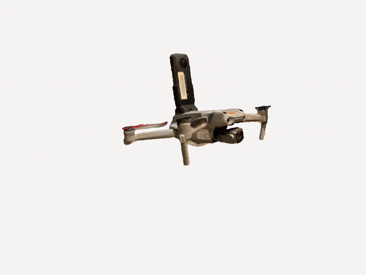

###### READMEv2.0   [Made with ❤️ by](https://github.com/sponsors/Felipegalind0) [Felipe Galindo](https://felipegalind0.github.io)

# Insta360-Drone-Mount
An Open Source Insta360 Drone Mount

Drones equipped with a 360 camera allow for a unique and immersive experience that can benefit both professionals and hobbyists alike. With a 360 camera, users are able to capture stunning visuals that were previously only achievable through expensive and complex equipment. By using an open source drone with a 360 camera, users can benefit from a wide range of features and capabilities, such as the ability to take high-quality aerial footage, live-streaming capabilities, and the ability to take panoramic images. Additionally, open source projects provide users with the freedom to customize their system and create their own unique experience.

\
[Insta360 Drone Mount 3D Model](https://poly.cam/capture/0CF75EFF-5A26-4E8A-AE91-CFA4F14639BB)

https://www.thingiverse.com/thing:5532281

https://www.continuum.umn.edu/2022/02/students-take-library-equipment-to-new-heights/

